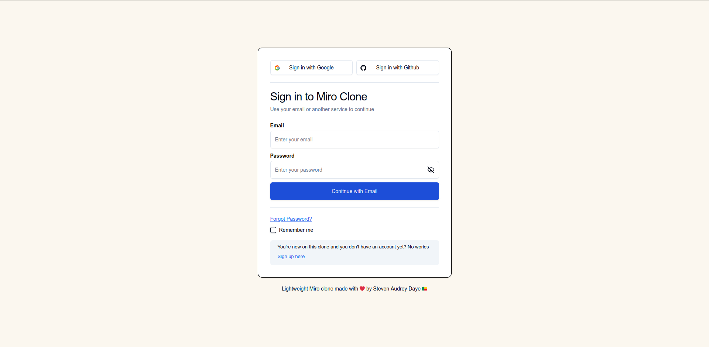

# Miro Clone | Real Time Whiteboard Collaboration App

🔗 Production URL: Coming soon 😉

A minimalistic lighweight clone version of the Miro whiteboarding app. This clone covers the core fundamental features of Miro on whiteboarding productivity.

## Status: In Progress

I'm developing a comprehensive Miro clone app designed for real-time collaboration and creative brainstorming. The app features a versatile whiteboard with tools for text, shapes, sticky notes, and freehand drawing, along with layering and coloring functionalities. It leverages Next.js 15 for performance and scalability, uses TailwindCSS and ShadcnUI for modern styling, and supports real-time collaboration through a robust database and secure authentication system. The goal is to provide an intuitive, responsive, and scalable platform for teams and individuals to collaborate effectively.

### Technologies

- **Next.js 15**: Utilized for building the front-end interface and ensuring a seamless, server-rendered application.
- **React 19**: Latest version of React as of date for an optimized app performance.
- **Convex Realtime Backend**: Powers real-time communication features, enabling instant board updates.
- **TypeScript**: Provides type safety and improves code maintainability across the project.
- **TailwindCSS**: Used for designing a responsive and modern user interface.
- **Schadcn UI**: Helps in building reusable and consistent UI components.

### Features Covered

#### Whiteboard

- **Core Feature**: Develop a blank canvas that serves as the foundation for all creative and collaborative activities.
- **Implementation**: Use scalable vector graphics (SVG) or canvas elements to allow infinite zooming and panning.
- **User Experience**: Ensure the whiteboard is responsive and intuitive, supporting seamless interactions on different devices and screen sizes.

#### Toolbar with Text, Shapes, Sticky Notes & Pencil

- **Tool Variety**: Provide users with essential tools for visual thinking and brainstorming.
- **Text Tool**: Enable adding, editing, and formatting text with different fonts, sizes, and styles.
- **Shapes**: Offer a variety of shapes (rectangles, circles, triangles, etc.) with customizable dimensions and colors.
- **Sticky Notes**: Allow users to add colorful sticky notes with text for quick annotations and ideas.
- **Pencil Tool**: Facilitate freehand drawing for more organic and creative input.
- **User Interface**: Design an intuitive and accessible toolbar, possibly with drag-and-drop functionality.

#### Layering Functionality

- **Depth Control**: Allow users to stack objects on different layers, similar to graphic design software.
- **Management Tools**: Implement options to move objects forward or backward, lock layers, and group/ungroup elements.
- **Enhanced Creativity**: Support complex designs and organized workflows by maintaining a clear and editable structure.

#### Coloring System

- **Customization**: Provide a rich color palette and support for custom colors to personalize the whiteboard elements.
- **User Preferences**: Include options for saving favorite colors and using eyedropper tools to match colors from the canvas.
- **Consistency**: Ensure color choices are accessible and consistent across different sessions and devices.

#### Undo & Redo Functionality

- **Non-Destructive Editing**: Implement a robust undo/redo system to allow users to revert or reapply changes easily.
- **User Control**: Provide keyboard shortcuts (e.g., Ctrl+Z for undo, Ctrl+Y for redo) for quick access.
- **Data Integrity**: Ensure the functionality is reliable and doesn’t compromise the whiteboard’s state.

#### Keyboard Shortcuts

- **Efficiency**: Enable keyboard shortcuts for common actions (e.g., copy, paste, delete, select all).
- **Customization**: Allow users to customize shortcuts according to their preferences.
- **Productivity**: Increase user productivity by reducing the need for repetitive mouse actions.

#### Real-Time Collaboration

- **Multi-User Support**: Facilitate real-time collaboration where multiple users can edit the whiteboard simultaneously.
- **Synchronization**: Use WebSockets or similar technologies to ensure changes are instantly reflected across all users’ screens.
- **Conflict Resolution**: Implement mechanisms to handle conflicts and maintain consistency, such as locking objects when edited.

#### Real-Time Database

- **Persistent Storage**: Use databases like Firebase, Supabase, or similar for real-time data storage and retrieval.
- **Scalability**: Ensure the database can handle multiple concurrent users and large amounts of data efficiently.
- **Reliability**: Implement backup and recovery systems to prevent data loss.

#### Auth, Organizations, and Invites

- **User Authentication**: Provide secure login and signup options using OAuth, JWT, or similar authentication methods.
- **Organizations**: Allow users to create and join organizations, enabling structured team collaboration.
- **Invites**: Implement invite functionality to add members to whiteboards or organizations, possibly through email or shareable links.

#### Favoriting Functionality

- **Quick Access**: Allow users to mark whiteboards or specific elements as favorites for easy retrieval.
- **Personalization**: Store and display favorites in a dedicated section, enhancing user experience.
- **Consistency**: Sync favorites across devices and sessions for a seamless experience.

#### Next.js 15 Framework

- **Performance**: Leverage Next.js 15 for its server-side rendering (SSR) and static site generation (SSG) capabilities.
- **SEO Benefits**: Improve search engine optimization (SEO) with server-rendered pages.
- **Scalability**: Utilize Next.js’s built-in features for routing, API routes, and optimizations to build a scalable application.

#### TailwindCSS & ShadcnUI Styling

- **Modern Design**: Use TailwindCSS for utility-first CSS, enabling rapid styling and consistent design.
- **Component Library**: Incorporate ShadcnUI for pre-built, accessible UI components that integrate seamlessly with TailwindCSS.
- **Customization**: Allow extensive customization of styles to fit the desired aesthetic and branding.

Upon deployment, the Miro clone app will offer users an intuitive and robust platform for real-time collaboration and creative brainstorming. With its comprehensive toolbar, layering, and coloring functionalities, users can easily create, organize, and personalize their whiteboards. The app’s real-time database and synchronization features will ensure seamless collaboration across multiple users, while the secure authentication system will support structured team environments. Additionally, the use of Next.js 15, TailwindCSS, and ShadcnUI will provide a modern, responsive, and scalable user experience. Overall, the app will be a versatile tool for teams and individuals looking to enhance their remote collaboration and visual project management.
